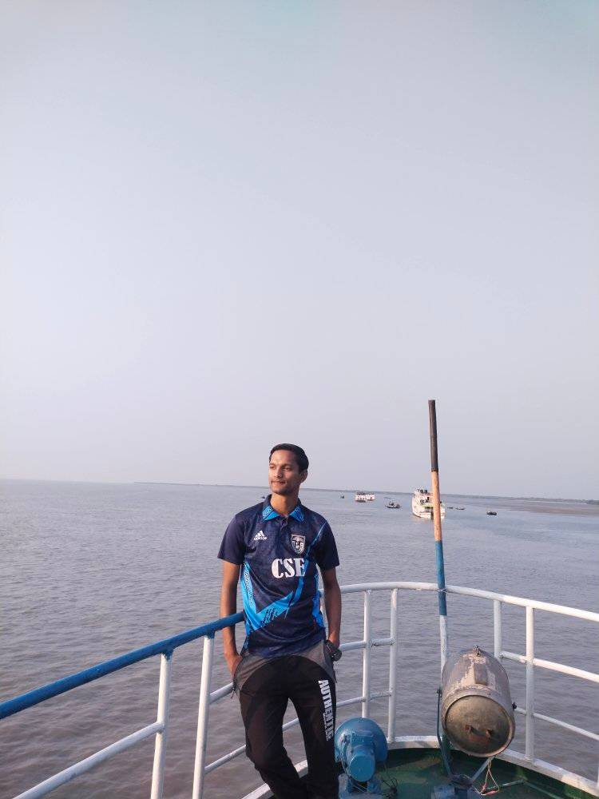

# Portfolio of Sojun Chandra

 
About: 
I am a undergraduate Computer Science and Engineering student.
I am continuously learning programming knowledge.Now i am a third year student. 
  
Skills:
<li>OOP of Java 
<li> C++ and C
<li> Git and GitHub
  
Projects Done:
<li> SnakeGame
<li> Simple Calculator
<li> Age Calculator

   
Educational qualification:
<li>Khulna University(current)
<li> Navy College Dhaka
<li> Kasba Government High School